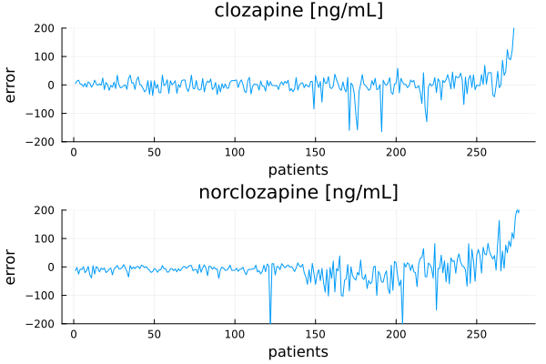
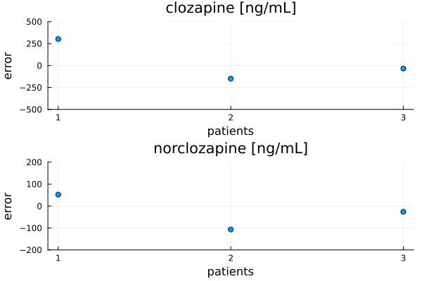

# Clozapine Toxicity Predictor

[](https://doi.org/10.5281/zenodo.11048224)

This [Julia](https://julialang.org/) toolbox allows predicting [clozapine](https://en.wikipedia.org/wiki/Clozapine) (CLO) and [norclozapine](https://en.wikipedia.org/wiki/Desmethylclozapine) (NCLO) blood concentrations.

Individual recommended safe dose range can also be predicted:


## Performance

The model are actively developed and we expect its accuracy to improve.

### Training

```
       CSV 0.10.14
DataFrames 1.7.0
      JLD2 0.5.8
      Flux 0.14.25
       MLJ 0.20.7
   MLJFlux 0.6.0
     NNlib 0.9.24
Optimisers 0.3.4
     Plots 1.40.8
 StatsBase 0.34.3

Loading: clozapine_train.csv

Number of entries: 87
Number of features: 11

Standardizing
Splitting: 70:30

Initial RMSE: 79.7404
Final RMSE: 74.1407
Model parameters:
  n_hidden: 170
  dropout: 0.07
  η: 0.01
  epochs: 5600
  batch_size: 2
  λ: 0.1
  α: 0.0

Regressor accuracy: training
  R²: 1.0
  RMSE: 16.03
Regressor accuracy: validating
  R²: 0.9
  RMSE: 89.49
Regressor accuracy:
  R²: 1.0
  RMSE: 17.39

Initial RMSE: 61.3673
Final RMSE: 61.4346
Model parameters:
  n_hidden: 64
  dropout: 0.16
  η: 0.01
  epochs: 1000
  batch_size: 2
  λ: 0.1
  α: 0.0

Regressor accuracy: training
  R²: 0.98
  RMSE: 22.76
Regressor accuracy: validating
  R²: 0.85
  RMSE: 54.89
Regressor accuracy:
  R²: 0.98
  RMSE: 20.37

Classification based on predicted clozapine level:
Confusion matrix:
  misclassification rate: 0.02
  accuracy: 0.98
                     group
                  norm   high   
                ┌──────┬──────┐
           norm │  143 │    3 │
prediction      ├──────┼──────┤
           high │    0 │   28 │
                └──────┴──────┘
         
Classification adjusted for predicted norclozapine level:
Confusion matrix:
  misclassification rate: 0.06
  accuracy: 0.94
                     group
                  norm   high   
                ┌──────┬──────┐
           norm │  134 │    2 │
prediction      ├──────┼──────┤
           high │    9 │   29 │
                └──────┴──────┘
```



In the figure above, patients are sorted by increasing CLO or NCLO measured level.

Adjusted clozapine level is the classifier prediction modified by predicted norclozapine concentration.

Toxic clozapine level has been defined as > 550 ng/mL, recommended therapeutic concentration has been defined as > 250 ng/mL [source: [10.1192/bjp.2023.27](https://doi.org/10.1192/bjp.2023.27)].

### Testing

```
       CSV 0.10.14
DataFrames 1.7.0
      JLD2 0.5.8
       MLJ 0.20.7
   MLJFlux 0.6.0
      Flux 0.14.25
     NNlib 0.9.24
Optimisers 0.3.4
     Plots 1.40.8
 StatsBase 0.34.3

Loading: clozapine_test.csv
Loading: clozapine_regressor_model.jlso
Loading: norclozapine_regressor_model.jlso
Loading: scaler_clo.jld
Loading: scaler_nclo.jld

Number of entries: 3
Number of features: 11

Predicted levels:
Subject ID: 1     CLO level: 806.4   prediction: 395.6   error: -410.8
Subject ID: 1    NCLO level: 317.7   prediction: 211.3   error: -106.4

Subject ID: 2     CLO level: 300.5   prediction: 410.5   error: 110.0
Subject ID: 2    NCLO level: 138.3   prediction: 238.6   error: 100.3

Subject ID: 3     CLO level: 264.5   prediction: 269.0   error: 4.5
Subject ID: 3    NCLO level: 161.1   prediction: 170.5   error: 9.4

Predicting: CLOZAPINE
  R²: 0.01
  RMSE: 245.54
Predicting: NORCLOZAPINE
  R²: -0.13
  RMSE: 84.6

Classification based on predicted clozapine level:
Confusion matrix:
  misclassification rate: 0.33
  accuracy: 0.67
                     group
                  norm   high   
                ┌──────┬──────┐
           norm │    2 │    1 │
prediction      ├──────┼──────┤
           high │    0 │    0 │
                └──────┴──────┘
         
Classification adjusted for predicted norclozapine level:
Confusion matrix:
  misclassification rate: 0.33
  accuracy: 0.67
                     group
                  norm   high   
                ┌──────┬──────┐
           norm │    2 │    1 │
prediction      ├──────┼──────┤
           high │    0 │    0 │
                └──────┴──────┘
```



## Quickstart

Install the latest Julia version from [https://julialang.org/downloads/](https://julialang.org/downloads/) (version ≥1.11 is required).

Clone this repository, go to its folder and run to install required packages (this has to be done only once):

```sh
julia src/install.jl
```

Start the server:

```sh
julia src/install.jl
```

The server is listening on port 8080. With your web browser, go to [http://localhost:8080](http://localhost:8080), enter patient's data and click the "PREDICT" button.


Alternatively, the server is also available online at [https://csk.umed.pl/clotop](https://csk.umed.pl/clotop).

## How to Cite

If you use this tool, please acknowledge us by citing our [paper](https://doi.org/10.1016/j.psychres.2024.116256).

```bibtex
@article{wysokinski_2024,
    title = {Clozapine Toxicity Predictor: deep neural network model predicting clozapine toxicity and its therapeutic dose range},
    journal = {Psychiatry Research},
    pages = {116256},
    year = {2024},
    issn = {0165-1781},
    doi = {https://doi.org/10.1016/j.psychres.2024.116256},
    url = {https://www.sciencedirect.com/science/article/pii/S0165178124005419},
    author = {Adam Wysokiński and Joanna Dreczka},
}
```

## Contributors

Below is the list of contributors and their affiliations.

[Adam Wysokiński](mailto:adam.wysokinski@umed.lodz.pl) [](https://orcid.org/0000-0002-6159-6579)

[Joanna Dreczka](mailto:jdreczka@csk.umed.pl)

[](https://en.umed.pl)

## License

This software is licensed under [The 2-Clause BSD License](LICENSE).

## Disclaimers

**DISCLAIMER: THIS TOOL HAS THE RESEARCH USE ONLY (RUO) STATUS**

This tool and all associated information, including but not limited to, text, graphics, images and other material contained on this website, has the Research Use Only (RUO) status. It is intended for scientific research only. It must not be used for diagnostic or medical purposes.

**DISCLAIMER: THIS WEBSITE DOES NOT PROVIDE MEDICAL ADVICE**

This tool and all associated information, including but not limited to, text, graphics, images and other material contained on this website are for informational purposes only. No material on this site is intended to be a substitute for professional medical advice, diagnosis or treatment. Always seek the advice of your physician or other qualified health care provider with any questions you may have regarding a medical condition or treatment and before undertaking a new health care regimen, and never disregard professional medical advice or delay in seeking it because of something you have read on this website.