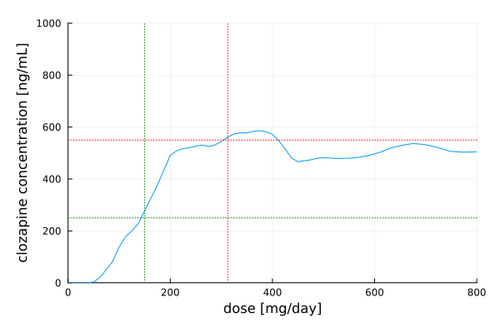

# Clozapine Toxicity Predictor

[](https://doi.org/10.5281/zenodo.11048224)

This [Julia](https://julialang.org/) toolbox allows predicting [clozapine](https://en.wikipedia.org/wiki/Clozapine) (CLO) and [norclozapine](https://en.wikipedia.org/wiki/Desmethylclozapine) (NCLO) blood concentrations using RandomForestClassifier and RandomForestRegressor models.

Individual recommended safe dose range can also be predicted:



## Performance

The models are actively developed and we expect their accuracy to improve.

### Classifier

Current classifier accuracy (train-test split 80:20):

    Classifier training accuracy:
        log_loss: 0.07
        AUC: 1.0
        misclassification rate: 0.0
        accuracy: 1.0
    confusion matrix:
        sensitivity (TPR): 1.0
        specificity (TNR): 1.0
                         group
                      norm   high   
                    ┌──────┬──────┐
               norm │  131 │    0 │
    prediction      ├──────┼──────┤
               high │    0 │   27 │
                    └──────┴──────┘
             
    Classifier testing accuracy:
        log_loss: 0.08
        AUC: 1.0
        misclassification rate: 0.0
        accuracy: 1.0
    confusion matrix:
        sensitivity (TPR): 1.0
        specificity (TNR): 1.0
                         group
                      norm   high   
                    ┌──────┬──────┐
               norm │   36 │    0 │
    prediction      ├──────┼──────┤
               high │    0 │    4 │
                    └──────┴──────┘

Final model accuracy:

    Classifier accuracy:
        log_loss: 0.06
        AUC: 1.0
        misclassification rate: 0.0
        accuracy: 1.0
    confusion matrix:
        sensitivity (TPR): 1.0
        specificity (TNR): 1.0
                         group
                      norm   high   
                    ┌──────┬──────┐
               norm │  167 │    0 │
    prediction      ├──────┼──────┤
               high │    0 │   31 │
                    └──────┴──────┘

### Regressor

Current regressor model accuracy (train-test split 80:20):

    Predicting: CLOZAPINE
    Regressor training accuracy
        R²: 0.96
        RMSE: 64.78
    Regressor testing accuracy
        R²: 0.9
        RMSE: 87.06
    Predicting: NORCLOZAPINE
    Regressor training accuracy
        R²: 0.96
        RMSE: 29.39
    Regressor testing accuracy
        R²: 0.94
        RMSE: 33.88

Final model accuracy:

    Predicting: CLOZAPINE
    Regressor accuracy
        R²: 0.97
        RMSE: 57.45
    Predicting: NORCLOZAPINE
    Regressor accuracy
        R²: 0.97
        RMSE: 25.23


### Testing

Current model accuracy:

    Regressor:
    Subject ID: 1   CLO level: 609.0    prediction: 453.4   RMSE: 155.6
    Subject ID: 1   NCLO level: 306.6   prediction: 223.4   RMSE: 83.2
    
    Subject ID: 2   CLO level: 465.2    prediction: 651.8   RMSE: 186.6
    Subject ID: 2   NCLO level: 181.3   prediction: 270.0   RMSE: 88.7
    
    Subject ID: 3   CLO level: 120.6    prediction: 459.5   RMSE: 338.9
    Subject ID: 3   NCLO level: 55.9    prediction: 194.8   RMSE: 138.9
    
    Regressor accuracy:
    Predicting: CLOZAPINE
        R²: -0.3802
        RMSE:   240.7517
    Predicting: NORCLOZAPINE
        R²: -0.0846
        RMSE:   106.5882

    Classifier:
    Subject ID: 1   group: HIGH     prediction: NORM, prob = 0.79   adj. prediction: NORM, prob = 1.0
    Subject ID: 2   group: NORM     prediction: HIGH, prob = 0.77   adj. prediction: HIGH, prob = 0.87
    Subject ID: 3   group: NORM     prediction: NORM, prob = 0.92   adj. prediction: NORM, prob = 1.0
    
    Classifier accuracy:
        log_loss: 1.035
        AUC: 0.5
        misclassification rate: 0.67
        accuracy: 0.33
    confusion matrix:
        sensitivity (TP): 0.0
        specificity (TP): 0.5
                         group
                      norm   high   
                    ┌──────┬──────┐
               norm │    1 │    1 │
    prediction      ├──────┼──────┤
               high │    1 │    0 │
                    └──────┴──────┘
             
    Adjusted classifier accuracy:
        misclassification rate: 0.67
        accuracy: 0.33
    confusion matrix:
        sensitivity (TP): 0.0
        specificity (TP): 0.5
                         group
                      norm   high   
                    ┌──────┬──────┐
               norm │    1 │    1 │
    prediction      ├──────┼──────┤
               high │    1 │    0 │
                    └──────┴──────┘


## Quickstart

Clone this repository, go to its folder and run:

```sh
julia src/server.jl
```

Next, go to the local website at [http://localhost:8080](http://localhost:8080), enter patient's data and click the "PREDICT" button.


(!) Adjusted clozapine level is the classifier prediction modified by predicted concentration.

Toxic clozapine level has been defined as > 550 ng/mL, recommended therapeutic concentration has been defined as > 220 ng/mL [source: [10.1192/bjp.2023.27](https://doi.org/10.1192/bjp.2023.27)].

## How to Cite

If you use this tool, please acknowledge us by citing our [paper](https://zenodo.org/records/11048224).

## Contributors

Below is the list of contributors and their affiliations.

[Adam Wysokiński](mailto:adam.wysokinski@umed.lodz.pl) [](https://orcid.org/0000-0002-6159-6579)

[Joanna Dreczka](mailto:jdreczka@csk.umed.pl)

[](https://en.umed.pl)

## License

This software is licensed under [The 2-Clause BSD License](LICENSE).

## Disclaimers

**DISCLAIMER: THIS TOOL HAS THE RESEARCH USE ONLY (RUO) STATUS**

This tool and all associated information, including but not limited to, text, graphics, images and other material contained on this website, has the Research Use Only (RUO) status. It is intended for scientific research only. It must not be used for diagnostic or medical purposes.

**DISCLAIMER: THIS WEBSITE DOES NOT PROVIDE MEDICAL ADVICE**

This tool and all associated information, including but not limited to, text, graphics, images and other material contained on this website are for informational purposes only. No material on this site is intended to be a substitute for professional medical advice, diagnosis or treatment. Always seek the advice of your physician or other qualified health care provider with any questions you may have regarding a medical condition or treatment and before undertaking a new health care regimen, and never disregard professional medical advice or delay in seeking it because of something you have read on this website.